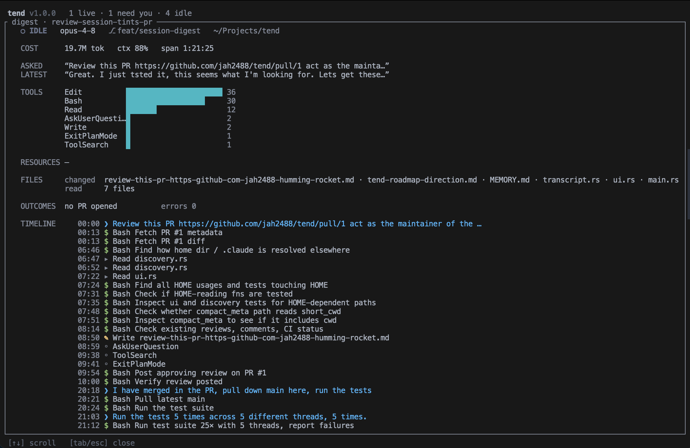

# tend

A small terminal UI that keeps your [Claude Code](https://claude.com/claude-code) sessions in view — which are **working**, which **need you**, and which are **done**.

If you run several Claude Code sessions at once (terminal, editor, SDK), it's easy to lose track of which one is blocked on a permission prompt and which is quietly churning. `tend` watches them all and shows a live, glanceable list.

## What it shows

Per session, at a glance:

- **State** — working · needs you · idle · done · stale · error (color-coded, animated when live)
- **What it's doing** — a one-line summary, current branch, and any PR opened during the session
- **Cost** — total tokens, a context-fullness bar, and live CPU%
- **Activity** — tool calls and web requests made, plus which integrations (Notion, Slack, …) it touched

Terminal sessions get a full card; editor/SDK sessions collapse into a compact one-liner so background work doesn't crowd out what you care about.

**Worktrees:** if you run several sessions in the same repo across different [git worktrees](https://git-scm.com/docs/git-worktree), `tend` shows the worktree name (marked `⑂`) right next to the branch, so sibling sessions stay easy to tell apart.

## Install

The quickest way — downloads the latest release binary into `~/.local/bin`,
verifies its SHA-256 checksum, and handles `chmod`/Gatekeeper for you:

```sh
curl -fsSL https://raw.githubusercontent.com/jah2488/tend/main/install.sh | bash
```

Piping a script straight into a shell deserves a look first — read exactly what
you'd be running here:
[`install.sh`](https://github.com/jah2488/tend/blob/main/install.sh). It uses
strict mode, installs only to `~/.local/bin` (override with `TEND_INSTALL_DIR`),
needs no root, and runs nothing it downloads. If you'd rather not pipe, download
that file, read it, and run it locally.

Make sure `~/.local/bin` is on your `PATH`, then run `tend`. A pre-built binary
is published for macOS (Apple Silicon); other platforms build from source below.

### From source

Requires a [Rust toolchain](https://rustup.rs).

```sh
git clone <this-repo> tend
cd tend
cargo install --path .
```

Then run it:

```sh
tend
```

Or just run it in place without installing:

```sh
cargo run --release
```

## Update

Already have `tend` installed? Pull the latest and reinstall:

```sh
cd tend
git pull
cargo install --path . --force
```

`--force` is required — `cargo install` skips reinstalling unless you pass it. Then quit any running instance (`q`) and relaunch `tend`; a running process keeps the old binary until you restart it.

## Releasing (maintainers)

Commit your changes, then let [`release.sh`](release.sh) do the rest — version
bump, test/clippy gate, build, checksum, commit, tag, push, and GitHub release:

```sh
./release.sh patch   # or: minor | major | an explicit X.Y.Z
```

It runs the tests and lint before changing anything and pauses for confirmation
before pushing or publishing.

## How it works

`tend` reads the session metadata Claude Code already writes under `~/.claude/` — session files in `~/.claude/sessions/` and transcripts in `~/.claude/projects/`. It parses these read-only and never modifies them. It checks whether each session's process is still alive to tell live work from finished work.

No network calls, no config, no telemetry.

No network calls, no config, no telemetry — *tend itself* never mutates anything. Actions
that change your repo live in [extensions](#extensions), which run only when you invoke them.

## Keys

| Key | Action |
| --- | --- |
| `↑` / `↓` or `j` / `k` | Move selection |
| `Enter` / `a` | Open the action menu for the selected session |
| `Tab` | Open the [session digest](#session-digest) for the selected session |
| `r` / `s` | Refresh now |
| `q` / `Esc` | Quit |

In the action menu: `↑`/`↓` to choose, `Enter` (or an action's own key) to run, `Esc` to cancel.

## Extensions

`tend` observes; extensions act. An extension is any executable on your `PATH` named
`tend-action-<name>`. tend discovers it automatically (no config file), shows it in the action
menu, and runs it against the selected session. The first action shipped this way is
[`tend-ship`](https://github.com/) — commit and push a session's work.

tend stays a read-only observer: it never commits, pushes, or touches the network itself. An
extension runs as a normal subprocess with *your* privileges and is responsible for whatever
it does. tend just hands it the terminal and the selected session's locators.

**Self-description.** When tend finds `tend-action-<name>`, it runs `tend-action-<name>
--tend-describe` once and expects a single line of JSON on stdout:

```json
{"name": "Ship", "key": "S", "when": {"source": "terminal", "has_branch": true}}
```

| Field | Meaning |
| --- | --- |
| `name` | Label shown in the menu (defaults to `<name>`) |
| `key` | Suggested single-char shortcut (advisory; tend resolves collisions) |
| `when` | Optional filter; the action is hidden for sessions it doesn't match |
| `when.source` | `"terminal"` or `"sdk"` |
| `when.has_branch` | `true`/`false` — require (or forbid) a git branch |
| `when.state` | One of `working`, `needs-you`, `idle`, `done`, `stale`, `error` |

Missing or malformed describe output is tolerated — the action is still listed under its
`<name>`, with no filter.

**Invocation.** When you run an action, tend leaves its TUI (so the extension can print and
prompt freely), runs the executable with these environment variables, then returns to the
dashboard:

| Variable | Value |
| --- | --- |
| `TEND_VERSION` | tend's semver — for compatibility checks |
| `TEND_ACTION` | The `<name>` it was invoked as |
| `TEND_SESSION_ID` | Claude Code session id |
| `TEND_PROJECT_DIR` | The session's working directory |
| `TEND_TRANSCRIPT` | Path to the session's transcript `.jsonl` (when it exists) |
| `TEND_GIT_BRANCH` | The session's git branch (when known) |
| `TEND_WORKTREE` | Linked worktree name (when the session is in one) |
| `TEND_SESSION_NAME` | Display name |
| `TEND_SOURCE` | `terminal` or `sdk` |

tend passes *locators*, never a data snapshot — read session data fresh from disk per
invocation, so your extension stays correct even if tend isn't running. Run `tend
--list-actions` to confirm tend discovers your extension and parsed its description.

**Writing one.** [`examples/tend-action-example`](examples/tend-action-example) is a
complete, commented reference — copy it, rename it to `tend-action-<name>`, put it on your
`PATH`, and it shows up in the menu. To try it immediately:

```sh
cp examples/tend-action-example ~/.local/bin/tend-action-example
tend --list-actions   # confirm discovery + describe parsing
tend                  # select a session, press Enter, choose "Example"
```

## Session tints

tend renders a small colored pip (`●`) before a session's name when that
session has a *tint* set. A tint is a user-chosen flag — distinct from the
state-driven left rule — useful for "this one's mine", "blocked on review",
"priority", etc.

tend doesn't pick tints itself. It reads them from a file convention any tool
can write to:

| Path | Contents |
| --- | --- |
| `~/.claude/tend-color/<session-id>` | One lowercase color name on a single line: `red`, `orange`, `yellow`, `green`, `blue`, `purple`, or `gray`. |

Missing file (or unrecognized contents) = no pip. tend garbage-collects entries
whose session id is no longer present each time it enumerates sessions, so
stale tints don't accumulate.

The first writer is the [`tend-color`](https://github.com/MattRice12/tend-color)
extension, which exposes a `↑/↓` picker via the action menu. Any other tool
that drops the same file works identically.

## Session digest

The list answers *which* sessions need you. Press `Tab` on a selected session to
open its **digest** — a read-only, scrollable account of what that session actually
did, read fresh from its transcript when you open it.



The panel is built from the transcript `tend` already parses — no network, no new
data source — and is frozen at open time, so the list refreshing underneath it can't
shuffle it out from under you. `↑`/`↓` scrolls; `Tab` or `Esc` closes.

What it shows, top to bottom:

- **Cost** — total tokens, context fullness, and the wall-clock span of activity.
- **Asked / Latest** — the first prompt that framed the session and the most recent one.
- **Tools** — a histogram of every tool the session called, by frequency. MCP calls
  collapse to `Server·method` (e.g. `Notion·notion-fetch`).
- **Resources** — MCP integrations touched, with counts, plus web requests.
- **Files** — files changed (listed) versus files read (counted).
- **Outcomes** — any PR opened during the session, and how many errors it hit.
- **Timeline** — the full chronological feed: every prompt, tool call, file read/edit,
  shell command, web request, PR, and error, each stamped with its time into the
  session. Tool families read by glyph (`▸` read · `✎` edit · `$` shell · `⌖` web ·
  `◦` other), with prompts, PRs, and errors called out in color.

## License

MIT — see [LICENSE](LICENSE).
